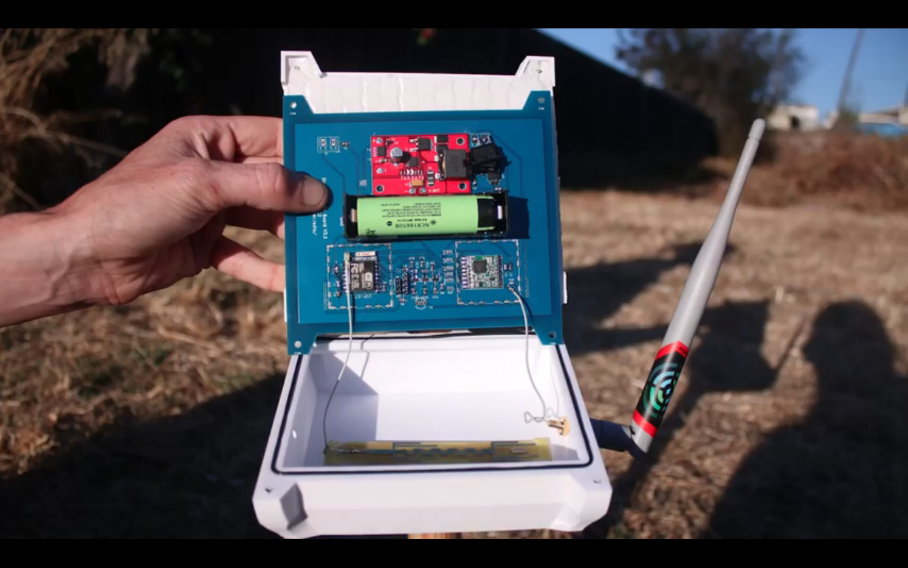
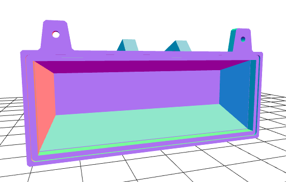

# Disaster Radio Enclosure v2

### The Challenge

We need a new design for the disaster radio enclosure. The main components that it needs to house/support are:

- a solar panel
- a PCB
- a battery
- an antenna

There is a nice video of the v0 enclosure on [this page](https://disaster.radio/updates/). Unfortunately, it had some problems:

- problem 1
- problem 2

We need two new designs:

1) one that can be produced in small quantities

2) one that can be mass-produced

### Budget

The project is mostly a labor of love, organized by volunteers, but we do have some budget. So far we've been paying two of our volunteers $35/hr to work on the firmware and PCB (i.e. well-below market rate).

### Photos

Photo of v0 enclosure

Rendering of v0 enclosure

