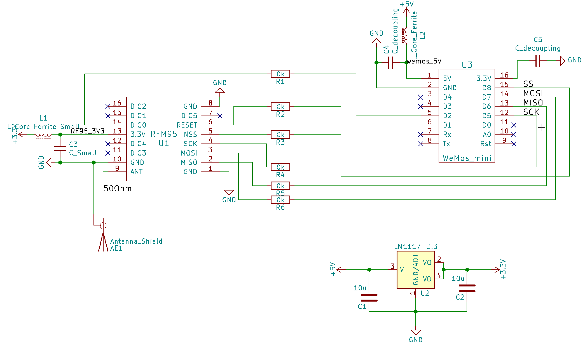
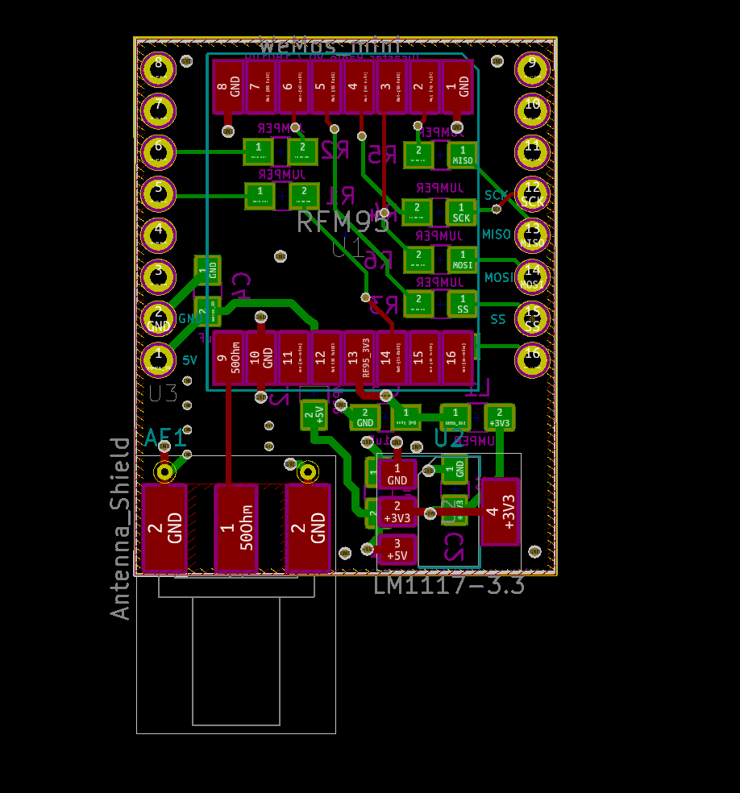

# lora-to-nodemcu-circuit

KiCad Circuit board for a Lora (RFM95) to the Wemo D1 Mini ESP8266 board connector for playing around with the two technologies. This board acts as a hat for the Wemo, and contains the lora chip, antenna and power circuits for powering the lora chip off of the 5v coming off of the Wemo's usb power.

